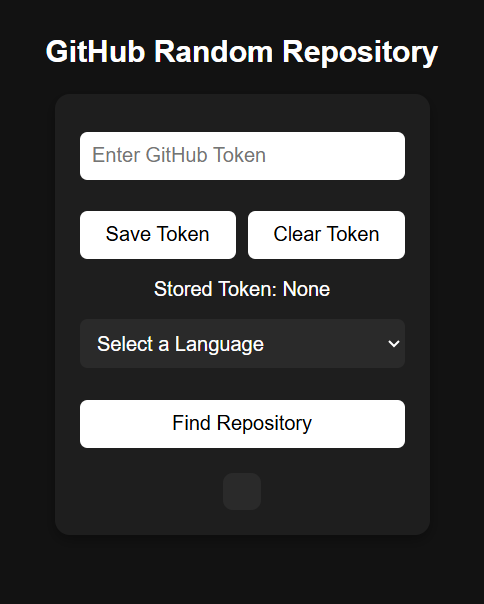
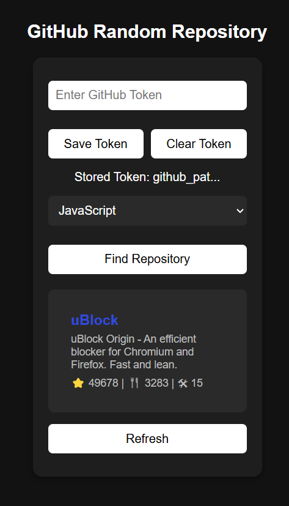
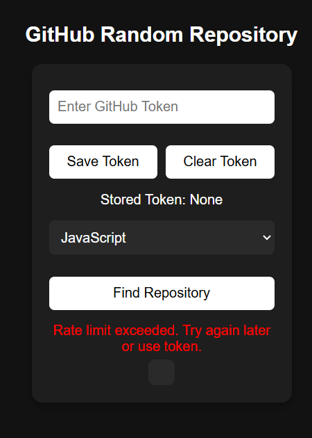

# GitHub Random Repository
A GitHub repository finder that allows users to select a programming language from a dropdown menu. | [Live Preview](https://reyfaldy.github.io/roadmap.sh-fe-projects/18-GitHub%20Random%20Repository/)
*use personal access tokens to be able find repo with no limit.

