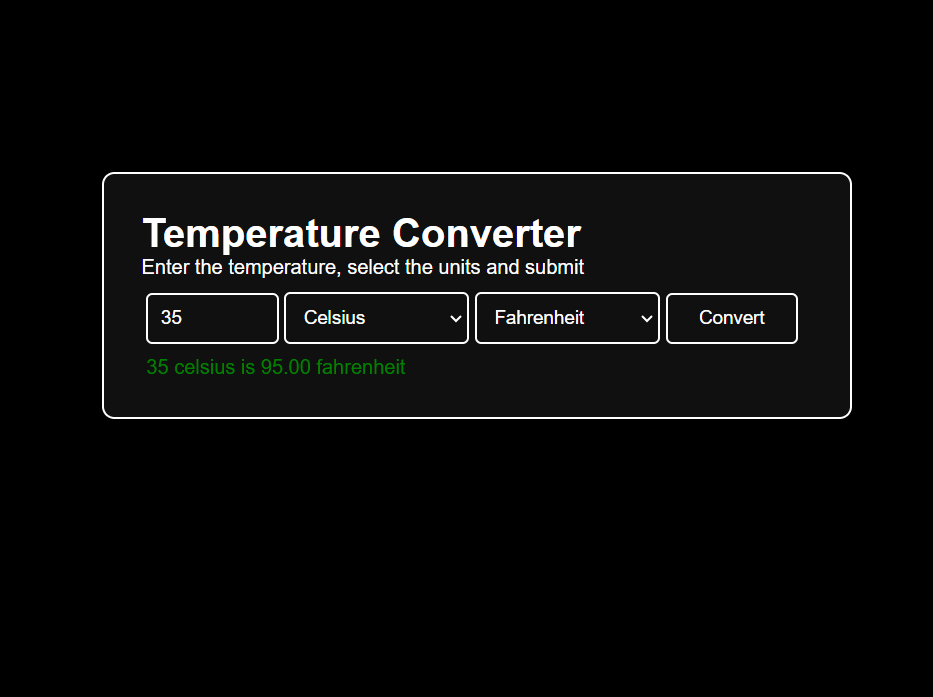

# Temperature Converter
a temperature converter that allows users to enter a temperature value, select the unit they want to convert from, and select the unit they want to convert to. | [Live Preview](https://reyfaldy.github.io/roadmap.sh-fe-projects/20-Temperature%20Converter/)

